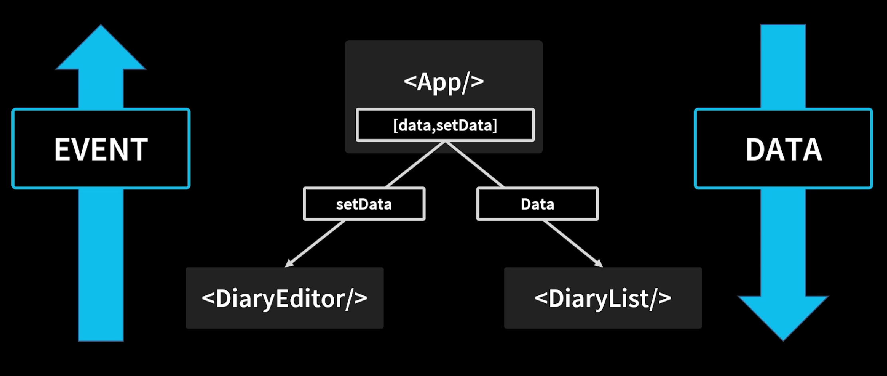

## 간단한 일기장 프로젝트📝

### 1. usestate 활용한 이름 및 내용 입력 받기

### 2. useRef를 활용한 포커스🕵️‍♀️(React에서 DOM 조작하기)

- 입력을 하지 않은 부분에 포커스를 주어 입력을 유도하기

const ref = useref(value) 는 사실,
{current : value} 객체로 받음.
즉 , 입력값이 있으면 그 현재 값을 ref로 받을 수 있음.
이에 위의 예제에서 current value의 입력이 조건 이하일 경우 focus를 주도록 함.

### 3. 트리🌲 구조의 react를 이해하고 데이터 추가 하기

부모 노드(여기서 <App/>)의 usestate를 활용해 데이터를 전달하는 컴포넌트에 set 함수를, 데이터를 전달 받는 컴포넌트에 변경된 데이터를 전달한다.

### 4. 데이터 삭제하기

onDlete 함수를 App -> DiaryList -> DiaryItem 하위 노드로 보내 처리함. 이후 다시 setdata
